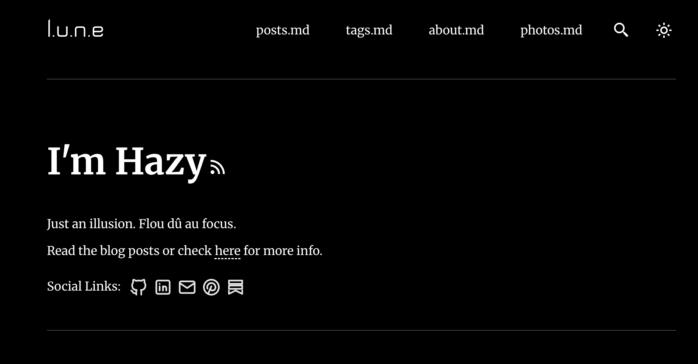

# floudeciel - Hazy 




[](https://conventionalcommits.org)
[](http://commitizen.github.io/cz-cli/)

My personal blog is built using the [AstroPaper](https://github.com/satnaing/astro-paper) theme, a minimal blog template. 

## 🔥 Features

- [x] type-safe markdown
- [x] super fast performance
- [x] accessible
- [x] responsive (mobile ~ desktops)
- [x] SEO-friendly
- [x] light & dark mode
- [x] fuzzy search
- [x] draft posts & pagination
- [x] sitemap & rss feed
- [x] highly customizable
- [x] dynamic OG image generation for blog posts
- [x] giscus comment
- [x] is-a.dev domain
- [x] photo page, sharp enhanced


## 💻 Tech Stack

**Main Framework** - [Astro](https://astro.build/)  
**Type Checking** - [TypeScript](https://www.typescriptlang.org/)  
**Component Framework** - [ReactJS](https://reactjs.org/)  
**Styling** - [TailwindCSS](https://tailwindcss.com/)  
**Fuzzy Search** - [FuseJS](https://fusejs.io/)  
**is-a.dev** - [is-a.dev](https://github.com/is-a-dev/register)  
**Deployment** - Github Page  
**Icons** - [Boxicons](https://boxicons.com/) | [Tablers](https://tabler-icons.io/)  
**Code Formatting** - [Prettier](https://prettier.io/)


## 👨🏻‍💻 Running Locally

The easiest way to run this project locally is to run the following command in your desired directory.

```bash
corepack enable
corepack prepare pnpm@latest --activate
pnpm install
pnpm run dev
pnpm run build
```
